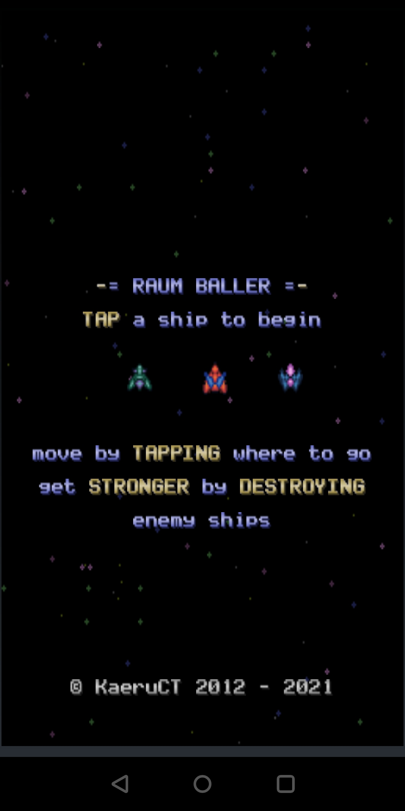

# RaumBaller

RaumBaller is an old-school scrolling shoot 'em up game.

You control your spaceship by tapping on the screen.

There are three different available spaceships to choose from, each with their own strengths and
weaknesses.

Your spaceship will shoot automatically, so all you need to focus is on staying alive as long as
possible by avoiding the baddies that want to destroy your ship.

The more enemies you kill, the more your score will go up, and the cannons of your chosen spaceship
will be upgraded automatically.

# Why

Many years ago I made [this game](https://github.com/KaeruCT/pixelshooter) using an amazing Java game framework called
[JGame](http://www.13thmonkey.org/~boris/jgame/) that now seems to be unmaintained. This repo still
contains code originally from that JGame framework but it was changed a bit because of automated
formatting tools.

But even back then, the framework supported Android. So I was curious if my code would run on my
shiny new phone. Turns out it worked! I decided to polish up the game a bit and release it for
others to enjoy.

# Screenshots

# Music

The level complete and game over jingles, and title screen music were composed by me.

You can listen to a different version of the title screen song on this
[SoundCloud mix](https://soundcloud.com/try_andy_beets/papaya-potential-mix-2021-deluxe-version).